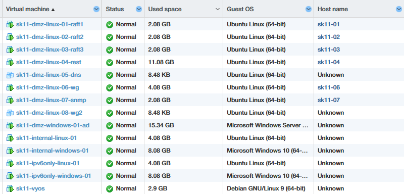

# Naloga in zasnova omrežja

V tej dokumentaciji opišemo nalogo podjetja in predlagano omrežno zasnovo. Podjetje je start-up brez obstoječe IT infrastrukture; cilj je postaviti ločena omrežna segmenta za uporabnike in za strežnike, zagotoviti varen dostop do interneta in izpostaviti le izbrane javne storitve.

## Cilji naloge

- Postaviti omrežje z ločenimi segmenti za **uporabnike** in **strežnike** (strogo ločeno prometno okolje).

- Vsi strežniki so gostovani v DMZ (po zahtevah naloge) — javne in interne storitve bodo fizično v DMZ, vendar z omejitvami dostopa.

- Izpostaviti navzven le izbrane storitve: WireGuard, `wg-portal` (HTTPS) in REST frontend (HTTPS).

- Kritične administrativne in imenik storitve (AD, DNS, SNMP) dostopne samo znotraj omrežja in preko VPN (ni direktnega WAN dostopa).

- Ohranjati poseben **ipv6only** segment za eksperimentalne/izobraževalne potrebe z NPTv6 preslikavo za odhodni promet.

## Opredelitev segmentov

- **DMZ (eth1)**: vsi strežniki (REST, wg-portal, WireGuard endpoint, AD/DNS, SNMP, ostali). Fizični lokaciji strežnikov sta v DMZ, vendar dostopi do nekaterih storitev omejeni z omrežnimi ACL.

- **INTERNAL (eth2)**: uporabniške delovne postaje, administrativne postaje in monitoring hosti. Od tu je dovoljen nadzorovan dostop do AD/DNS/SNMP v DMZ.

- **IPV6ONLY (eth3)**: eksperimentalni IPv6-only segment; omogoča učenje in testiranje IPv6 funkcionalnosti. Izhodni promet je preko NPTv6 preslikave na javni IPv6.

# Naprave

## Seznam virtualk

<figure data-latex-placement="ht">

<figcaption>Posnetek imen virtualk</figcaption>
</figure>

## Konvencija poimenovanja virtualk

Ime virtualke se vedno začne z `sk11` (naša skupina), nato sledi segment, operacijski sistem, zaporedna številka in kratek opis storitve. Oblika:

<div class="center">

`sk11-<segment>-<OS>-<NN>-<storitev>`  e.g. `sk11-dmz-linux-04-rest`

</div>

## Operacijski sistemi

- DMZ Linux virtualke uporabljajo **Ubuntu Server 26.04**.

- DMZ Active Directory virtualka uporablja **Windows Server 2022**.

- Internal Linux virtualke uporabljajo **Ubuntu Server 26.04**.

- Internal Windows virtualke uporabljajo **Windows 10**.

- IPv6-only Linux virtualke uporabljajo **Ubuntu Server 26.04**.

- IPv6-only Windows virtualke uporabljajo **Windows 10**.

## DMZ strežniki

| **VM name** | **IPv4 naslov** | **IPv6 naslov** | **Namen** |
|:---|:---|:---|:---|
| sk11-dmz-linux-01-raft1 | 192.168.11.101 | 2001:1470:fffd:a9::101 | Raft |
| sk11-dmz-linux-02-raft2 | 192.168.11.102 | 2001:1470:fffd:a9::102 | Raft |
| sk11-dmz-linux-03-raft3 | 192.168.11.103 | 2001:1470:fffd:a9::103 | Raft |
| sk11-dmz-linux-04-rest | 192.168.11.104 | 2001:1470:fffd:a9::104 | REST storitve |
| sk11-dmz-linux-05-dns | 192.168.11.105 | \- | DNS, ni v uporabi |
| sk11-dmz-linux-06-wg | 192.168.11.106 | 2001:1470:fffd:a9::106 | WireGuard VPN endpoint |
| sk11-dmz-linux-07-snmp | 192.168.11.107 | 2001:1470:fffd:a9::107 | SNMP / monitoring target |
| sk11-dmz-linux-08-wg2 | 192.168.11.108 | 2001:1470:fffd:a9::108 | neuporabljena |
| sk11-dmz-windows-01-ad | 192.168.11.201 | 2001:1470:fffd:a9::201 | Active Directory, DNS |

# Nastavitve na napravah

## Uporabniška imena

Uporabniki na linux `dmz` virtualkah so vsi poimenovani `zanzan0X`, kjer je X številka virtualke (npr sk11-dmz-linux-04). Na `internal` in `ipv6only` odjemalcih je uporabnik vedno samo `zanzann`.

## Splošno geslo

<div class="center">

</div>

## SSH

SSH je konfiguriran za prijavo prek ključev (avtentikacija z geslom je onemogočena) na privzetem portu 22.

- **pavle**: `AAAAC3NzaC1lZDI1NTE5AAAAIClsTiUna0lG4FgaZOZ8cpxWvlWM7h9B2dbL53+QXr3h`

- **zanzan**: `AAAAC3NzaC1lZDI1NTE5AAAAIIGRVCofZkoaEaAcW0LquGsYgpRyHZ4Dg0fqVlssZUIL`

Če želite začasno omogočiti prijavo z geslom, uredite datoteko\
`/etc/ssh/sshd_config.d/50-cloud-init.conf` in nastavite `PasswordAuthentication yes`, nato ponovno zaženite `sshd`.

## RDP

RDP je nastavljen na vseh napravah katere imajo GUI. Uporablja privzeti port 3389. Na Ubuntu ga omogočimo z Settings \> System \> Remote Desktop, in moramo potem nastaviti geslo, saj za RDP uporablja različno geslo ki je privzeto avtogenerirano.

# Povzetek storitev

| **Storitev** | **Gostitelj** | **Port (proto)** | **Javno?** | **Opombe** |
|:---|:---|:---|:---|:---|
| RDP | vsi GUI gostitelji | 3389 (tcp) | Ne | vsi notranji in ipv6only gostitelji ter AD strežnik |
| SSH | vsi DMZ gostitelji + vyos | 22 (tcp) | samo vyos | Storitev SSH je prisotna na vseh DMZ strežnikih; WAN SSH je dovoljen samo na vyos |
| Cilj SNMP (VyOS) | vyos | 161 (udp) | Ne | SNMP na VyOS; exporter zajema ta cilj |
| REST storitev (scriptum) | rest | 8080 (tcp) | Da | Obstaja javni DNAT |
| scriptum zaledje | rest | 4443 (tcp) | Da | Javno zaledno vozlišče |
| Library API (HTTP) | rest | 3000 (tcp) | Ne | Notranji HTTP API |
| Library API (HTTPS) | rest | 3443 (tcp) | Da | Javno HTTPS vozlišče |
| Library API (GraphQL) | rest | 30080, 30443 (tcp) | Ne | Notranji GraphQL vmesnik |
| DMZ DNS | dns-srv | 53 (udp/tcp) | Ne | Notranji DNS za odjemalce v DMZ |
| WireGuard strežnik | wg | 51820 (udp) | Da | PiVPN, uporablja lasten NAT/masquerade |
| wg-portal vmesnik | wg | 8888 (tcp) | Ne | Lokalni portalni vmesnik (samo interno) |
| Prometheus | snmp | 9090 (tcp) | Ne | Uporabniški vmesnik/storitev Prometheusa |
| `snmp_exporter` | snmp | 9116 (tcp) | Ne | Končna točka exporterja za Prometheus |
| Grafana | snmp | 3000 (tcp) | Ne | Uporabniški vmesnik Grafane za nadzorne plošče |
| AD storitve (DNS/Kerberos/LDAP/itd.) | AD | 53, 88, 389, 3268, 135, 123, 445, 464, 49152-65535 | Ne | Storitve Active Directory (samo interno) |

# VyOS

## Osnovne informacije

- **Ime naprave:** startup11-vyos

- **Domena:** startup11.local

- **Uporabnik:** vyos

- **Prijava možna izključno preko SSH ključa!!!**

## Omrežni vmesniki

| **Vmesnik** | **Opis**       | **IPv4**         | **IPv6**                |
|:------------|:---------------|:-----------------|:------------------------|
| eth0        | javni internet | 88.200.24.241/25 | 2001:1470:fffd:a8::2/64 |
| eth1        | DMZ            | 192.168.11.1/24  | 2001:1470:fffd:a9::1/64 |
| eth2        | interna LAN    | 10.11.0.1/24     | 2001:1470:fffd:aa::1/64 |
| eth3        | IPv6-only      | \-               | fd11:11:11::1/64        |

## Privzete usmeritve (statične usmeritve)

| **Destinacija** | **Naslednji hop**    |
|:----------------|:---------------------|
| 0.0.0.0/0       | 88.200.24.129        |
| ::/0            | 2001:1470:fffd:a8::1 |

## Oglasi usmerjevalnika (RA)

RA (oglasi usmerjevalnika) po vmesnikih in stanju SLAAC:

| **Vmesnik** | **Oglaševana predpona** | **RA zastavice** | **SLAAC omogočen?** |
|:---|:---|:---|:---|
| eth1 (DMZ) | 2001:1470:fffd:a9::/64 | managed, no-autonomous | Ne (prednost ima DHCPv6) |
| eth2 (INTERNAL) | 2001:1470:fffd:aa::/64 | autonomous | Da (SLAAC) |
| eth3 (IPV6ONLY) | fd11:11:11::/64 | managed, no-autonomous | Ne (prednost ima DHCPv6) |

Opombe: - Za IPv4 uporabljamo DHCP s statičnimi DHCPv4 mape za strežnike in pomembne gostitelje (ujemanje po MAC naslovu). - Za IPv6 je na INTERNAL omogočen SLAAC; IPV6ONLY uporablja DHCPv6, odjemalci pa naslove pridobijo prek DHCPv6, razen če je oglašen avtonomen predpon. Statične DHCPv6 mape uporabljamo samo za gostitelje, ki potrebujejo stalni, administrativno dodeljen naslov (strežniki, krmilniki). - Če vmesnik oglašuje tako `managed` kot `no-autonomous`, je SLAAC dejansko onemogočen in gostitelji morajo naslov pridobiti prek DHCPv6.

## NTP

NTP sinhronizacija uporablja naslednje strežnike:

| **NTP strežnik** |
|:-----------------|
| ntp.arnes.si     |
| time1.vyos.net   |
| time2.vyos.net   |
| time3.vyos.net   |

## Upravljanje s konfiguracijami

### Shranjevanje celotne konfiguracije

Če želite shraniti celotno trenutno konfiguracijo uporabite:

    configure
    save v6.conf
    exit

### Nalaganje celotne konfiguracije

Če želite naložiti celotno konfiguracijo iz datoteke (npr. `v6.conf`), uporabite:

    configure
    load v6.conf
    commit
    save
    exit

### Shranjevanje seznama ukazov

Če želite shraniti konfiguracijo v ukaznem formatu:

    show configuration commands > v6.commands

### Apliciranje seznama ukazov

Če želite aplicirati seznam ukazov iz datoteke (npr. `v6.commands`), uporabite:

    configure
    source v6.commands
    commit
    save
    exit

# DNS

DNS resolver je nameščen neposredno na VyOS in se odjemalcem oglašuje prek DHCP kot privzeti notranji resolver. Notranji odjemalci zato najprej uporabljajo VyOS DNS, zunanje poizvedbe pa se iz VyOS posredujejo proti upstream resolverjem.

## Upstream DNS strežniki

VyOS za neskupne domene posreduje poizvedbe na javne upstream strežnike.

| **Ponudnik** | **IPv4**   | **IPv6**             |
|:-------------|:-----------|:---------------------|
| **Ponudnik** | **IPv4**   | **IPv6**             |
| ARNES        | 193.2.1.66 | 2001:1470:8000::66   |
| Cloudflare   | 1.1.1.1    | 2606:4700:4700::1111 |

VyOS posluša DNS na naslovih `10.11.0.1`, `192.168.11.1`, `2001:1470:fffd:aa::1`, `2001:1470:fffd:a9::1` in `fd11:11:11::1`. Poizvedbe so sprejete le iz naslednjih omrežij: `10.11.0.0/24`, `192.168.11.0/24`, `2001:1470:fffd:aa::/64`, `2001:1470:fffd:a9::/64` in `fd11:11:11::/64`.

## Split DNS

Split DNS je nastavljen tako, da se poizvedbe za `startup11.local` ne pošiljajo na javne resolverje, ampak na notranji AD DNS strežnik. To pomeni:

- VyOS za domeno `startup11.local` uporablja conditional forward na AD DNS `192.168.11.201` oziroma `2001:1470:fffd:a9::201`;

- AD DNS ostane avtoritativni vir za notranje zapise, predvsem za SRV zapise, ki so potrebni pri prijavi v domeno;

- vse ostale poizvedbe grejo prek upstream strežnikov iz prejšnje tabele;

- stari Linux DNS strežnik na `192.168.11.105` trenutno ni v uporabi; lokalne DNS zahteve zato gredo neposredno na notranji AD DNS server.

## AD DNS zapisi

AD privzeto generira DNS zapise potrebne za njegovo delovanje, spodnja tabela pa prikazuje ročno dodane lokalne DNS zapise:

| **Hostname** | **A zapis** | **AAAA zapis** | **Opombe** |
|:---|:---|:---|:---|
| **Hostname** | **A zapis** | **AAAA zapis** | **Opombe** |
| raft1 | 192.168.11.101 | 2001:1470:fffd:a9::101 | raft vozlišče |
| raft2 | 192.168.11.102 | 2001:1470:fffd:a9::102 | raft vozlišče |
| raft3 | 192.168.11.103 | 2001:1470:fffd:a9::103 | raft vozlišče |
| rest | 192.168.11.104 | 2001:1470:fffd:a9::104 | REST / web storitev |
| dns | 192.168.11.105 | \- | stari DNS zapis za Linux, trenutno ni v uporabi |
| wg | 192.168.11.106 | 2001:1470:fffd:a9::106 | WireGuard gostitelj |
| snmp | 192.168.11.107 | 2001:1470:fffd:a9::107 | monitoring gostitelj |
| wg2 | 192.168.11.108 | 2001:1470:fffd:a9::108 | nov WireGuard gostitelj |
| ad | 192.168.11.201 | 2001:1470:fffd:a9::201 | dodatno ime AD strežnika |

## Opomba o upravljanju DNS

Ukazi za administracijo AD DNS strežnika so zbrani v ločeni datoteki `ad-dns-upravljanje.md`.

# DHCP

## DHCPv4

DHCP server ima dve skupini: **SERVERS** (192.168.11.0/24) z navedenimi statičnimi mapami in **USERS** (10.11.0.0/24) za uporabniške naprave z avtomatskim razponom.

| **Skupina** | **Subnet / opomba**                            |
|:------------|:-----------------------------------------------|
| SERVERS     | 192.168.11.0/24 (statične mape)                |
| USERS       | 10.11.0.0/24 (dinamični range 10.11.0.100-200) |

## DHCPv4 - statične mape

Statične DHCP mape so konfigurirane v DHCP strežniku na VyOS in ujemajo IP naslove s MAC naslovi, kot je prikazano spodaj. Konvencija je da je zadnja številka v naslovu 1XX za linux in 2XX za windows strežnike.

| **Ime**           | **MAC naslov**    | **IP naslov**  |
|:------------------|:------------------|:---------------|
| raft1             | 00:0c:29:15:42:6f | 192.168.11.101 |
| raft2             | 00:0c:29:2b:64:27 | 192.168.11.102 |
| raft3             | 00:0c:29:a2:5c:63 | 192.168.11.103 |
| rest              | 00:0c:29:17:1a:72 | 192.168.11.104 |
| dns               | 00:0c:29:4a:b1:99 | 192.168.11.105 |
| wg                | 00:0c:29:c4:d1:52 | 192.168.11.106 |
| snmp              | 00:0c:29:69:75:09 | 192.168.11.107 |
| wg2               | 00:0c:29:f9:2a:a8 | 192.168.11.108 |
| ad                | 00:0c:29:07:cf:1c | 192.168.11.201 |
| internal-linux-01 | 00:0c:29:aa:aa:01 | 10.11.0.101    |
| internal-win-01   | 00:0c:29:bb:bb:01 | 10.11.0.201    |

## DHCPv6

Uporaba DHCPv6 in SLAAC:

- DMZ: DHCPv6 uporabljamo za strežnike (razpon `2001:1470:fffd:a9::100`–`::1ff`), za pomembne gostitelje pa so nastavljene statične DHCPv6 mape.

- INTERNAL: SLAAC je privzeta izbira za odjemalce na `2001:1470:fffd:aa::/64`; statične DHCPv6 mape uporabljamo le za strežnike, ki potrebujejo fiksni IPv6 naslov.

- IPV6ONLY: za `fd11:11:11::/64` uporabljamo DHCPv6; gostitelji naslove pridobijo prek DHCPv6, statične mape pa dodamo le tam, kjer je to potrebno.

#### Statične DHCPv6 mape

Spodaj so navedene statične DHCPv6 mape z DUID/identifikatorji, ki se uporabljajo v konfiguraciji VyOS. Spet je konvencija da je zadnja številka v naslovu 1XX za linux in 2XX za windows naprave.

| **Gostitelj** | **DHCPv6 naslov** | **DUID / identifikator** |
|:---|:---|:---|
| dmz-windows-AD | 2001:1470:fffd:a9::201 | 00:01:00:01:31:86:a4:b0:00:0c:29:07:cf:26 |
| raft1 | 2001:1470:fffd:a9::101 | 00:02:00:00:ab:11:2b:e2:d4:90:70:f3:b3:37 |
| raft2 | 2001:1470:fffd:a9::102 | 00:02:00:00:ab:11:e1:94:d4:8a:18:52:ad:98 |
| raft3 | 2001:1470:fffd:a9::103 | 00:02:00:00:ab:11:92:37:c8:9a:00:b8:67:77 |
| rest | 2001:1470:fffd:a9::104 | 00:02:00:00:ab:11:5a:9d:49:65:ce:4a:b2:48 |
| snmp | 2001:1470:fffd:a9::107 | 00:02:00:00:ab:11:b8:b7:97:e3:eb:3c:a5:52 |
| wg | 2001:1470:fffd:a9::106 | 00:02:00:00:ab:11:80:f9:48:e8:e6:e2:12:59 |
| wg2 | 2001:1470:fffd:a9::108 | 00:02:00:00:ab:11:dd:e2:8d:62:21:b3:d9:00 |
| ipv6only-linux | fd11:11:11::101 | 00:04:db:bb:16:07:aa:ea:2b:a4:bb:02:58:b1:00:55:16:8b |
| ipv6only-windows | fd11:11:11::201 | 00:01:00:01:31:8e:75:9d:00:0c:29:05:57:f5 |

<div class="landscape">

# NAT in preusmeritve vrat

#### Namen

NAT je uporabljen za tri stvari: DNAT za izbrane javne storitve, SNAT/masquerade za odhodni promet in NAT66 (NPTv6) za IPv6-only segment. Hairpin pravila omogočajo dostop do javnih storitev tudi iz notranjega in DMZ omrežja.

## Opombe in primeri

- DNAT velja samo za izbrane porte in ciljne gostitelje.

- Hairpin DNAT/SNAT je omejen na storitve, ki jih je treba doseči prek javnega WAN naslova tudi iz notranjega omrežja.

- SNAT/masquerade se uporablja samo za odhodni promet prek `eth0`.

## IPv4 – DNAT

| **Pravilo** | **Opis** | **In** | **Destination** | **Port** | **Proto/Notes** | **Prevod / cilj** |
|:---|:---|:---|:---|:---|:---|:---|
| **Pravilo** | **Opis** | **In** | **Destination** | **Port** | **Proto/Notes** | **Prevod / cilj** |
| 110 | wan-to-wg0-51820-dnat | eth0 |  | 51820 | udp | 192.168.11.106:51820 (WireGuard) |
| 130 | wan-to-scriptum-8080-dnat | eth0 |  | 8080 | tcp | 192.168.11.104:8080 (scriptum) |
| 135 | wan-to-scriptum-4443-dnat | eth0 |  | 4443 | tcp | 192.168.11.104:4443 (scriptum TLS) |
| 140 | wan-to-library-https-3443-dnat | eth0 |  | 3443 | tcp | 192.168.11.104:3443 (library HTTPS) |
| 210 | hairpin-internal-to-public-services-dnat | eth2 | 88.200.24.241 | 8080 | tcp | 192.168.11.104:8080 |
| 211 | hairpin-dmz-to-public-services-dnat | eth1 | 88.200.24.241 | 4443, 3443 | tcp | 192.168.11.104:4443,3443 |

## IPv4 – SNAT

| **Pravilo** | **Opis** | **Out** | **Source** | **Proto/Notes** | **Prevod / opomba** |
|:---|:---|:---|:---|:---|:---|
| **Pravilo** | **Opis** | **Out** | **Source** | **Proto/Notes** | **Prevod / opomba** |
| 100 | snat-internal-to-internet | eth0 | 10.11.0.0/24 | masquerade | internet egress |
| 110 | snat-dmz-to-internet | eth0 | 192.168.11.0/24 | masquerade | internet egress |
| 120 | hairpin-internal-to-public-snat | eth1 | 10.11.0.0/24, dst 192.168.11.104 | tcp | 192.168.11.1 (return path) |
| 121 | hairpin-dmz-to-public-snat | eth1 | 192.168.11.0/24, dst 192.168.11.104 | tcp | 192.168.11.1 (return path) |

## IPv6 – NAT66

| **Pravilo** | **Out** | **Source** | **Proto/Notes** | **Prevod / cilj** |
|:---|:---|:---|:---|:---|
| **Pravilo** | **Out** | **Source** | **Proto/Notes** | **Prevod / cilj** |
| 10 | eth0 | fd11:11:11::/64 | ipv6 | translation prefix 2001:1470:fffd:ab::/64 (NPTv6) |

# Firewall

## Kratek povzetek

- **Model:** privzeto-zavrni (default-deny) — vse povezave niso dovoljene, razen izrecno dovoljenih.

- **Kaj je dovoljeno:** odjemalci v notranji mreži (INTERNAL) in DMZ lahko dostopajo do interneta; iz interne in DMZ mreže so izrecno dovoljeni dostopi do DMZ storitev (DNS, web, monitoring, AD), WireGuard gostom so dovoljeni upravljalni dostopi; ICMP/ICMPv6 za diagnostične potrebe je omejeno, a omogočeno tam, kjer je potrebno.

- **Kaj je blokirano:** naključni vhodni promet z interneta je privzeto zavrnjen, medsegmentni dostopi so blokirani, razen če obstaja specifično pravilo (npr. upravljanje, AD, monitoring).

- **Hairpin NAT:** notranji in DMZ odjemalci lahko dosežejo javne IPv4 storitve preko hairpin DNAT/SNAT za izbrane storitve.

- **IPv6:** obstaja vzporedna zbirka pravil za IPv6; za IPv6-only odjemalce so posebej omogočena pravila in NAT66 (NPTv6) za izhod v internet.

Spodaj so tabelarični izvlečki pravil in NAT pravil iz ‘v5.15.conf‘. Tabela uporablja `longtable` za lep izpis večstranskih tabel.

## IPv4 – Forward

### IPv4 – Forward (1–99)

| **Rule** | **Action** | **Description** | **In** | **Out** | **Source** | **Destination** | **Port** | **Proto/Notes** |
|:---|:---|:---|:---|:---|:---|:---|:---|:---|
| **Rule** | **Action** | **Description** | **In** | **Out** | **Source** | **Destination** | **Port** | **Proto/Notes** |
| 1 | accept | stateful-return |  |  |  |  |  | state established,related |
| 50 | accept | internal-to-internet | eth2 | eth0 | 10.11.0.0/24 |  |  | all protocols |
| 51 | accept | dmz-to-internet | eth1 | eth0 | 192.168.11.0/24 |  |  | all protocols |
| 52 | accept | internal-to-dmz-icmp | eth2 | eth1 |  |  |  | ICMP |
| 53 | accept | dmz-to-internal-icmp | eth1 | eth2 |  |  |  | ICMP |

### IPv4 – Forward (100–199)

| **Rule** | **Action** | **Description** | **In** | **Out** | **Source** | **Destination** | **Port** | **Proto/Notes** |
|:---|:---|:---|:---|:---|:---|:---|:---|:---|
| **Rule** | **Action** | **Description** | **In** | **Out** | **Source** | **Destination** | **Port** | **Proto/Notes** |
| 110 | accept | wan-to-wg0-51820 | eth0 | eth1 |  | 192.168.11.106 | 51820 | udp |
| 130 | accept | wan-to-scriptum-8080 | eth0 | eth1 |  | 192.168.11.104 | 8080 | tcp |
| 135 | accept | wan-to-scriptum-4443 | eth0 | eth1 |  | 192.168.11.104 | 4443 | tcp |
| 140 | accept | wan-to-library-https-3443 | eth0 | eth1 |  | 192.168.11.104 | 3443 | tcp |

### IPv4 – Forward (200–299)

| **Rule** | **Action** | **Description** | **In** | **Out** | **Source** | **Destination** | **Port** | **Proto/Notes** |
|:---|:---|:---|:---|:---|:---|:---|:---|:---|
| **Rule** | **Action** | **Description** | **In** | **Out** | **Source** | **Destination** | **Port** | **Proto/Notes** |
| 210 | accept | internal-to-dmz-dns-udp53 | eth2 | eth1 |  | 192.168.11.105 | 53 | udp |
| 211 | accept | internal-to-dmz-dns-tcp53 | eth2 | eth1 |  | 192.168.11.105 | 53 | tcp |
| 220 | accept | internal-to-wg-portal-8888 | eth2 | eth1 |  | 192.168.11.106 | 8888 | tcp |
| 230 | accept | internal-to-scriptum-8080 | eth2 | eth1 |  | 192.168.11.104 | 8080 | tcp |
| 231 | accept | internal-to-scriptum-4443 | eth2 | eth1 |  | 192.168.11.104 | 4443 | tcp |
| 240 | accept | internal-to-library-http-3000 | eth2 | eth1 |  | 192.168.11.104 | 3000 | tcp |
| 241 | accept | internal-to-library-https-3443 | eth2 | eth1 |  | 192.168.11.104 | 3443 | tcp |
| 242 | accept | internal-to-library-graphql | eth2 | eth1 |  | 192.168.11.104 | 30080, 30443 | tcp |
| 250 | accept | internal-to-grafana-3000 | eth2 | eth1 |  | 192.168.11.107 | 3000 | tcp |
| 251 | accept | internal-to-prometheus-9090 | eth2 | eth1 |  | 192.168.11.107 | 9090 | tcp |
| 252 | accept | internal-to-snmp-exporter-9116 | eth2 | eth1 |  | 192.168.11.107 | 9116 | tcp |
| 260 | accept | internal-to-ad-dns-udp53 | eth2 | eth1 |  | 192.168.11.201 | 53 | udp |
| 261 | accept | internal-to-ad-dns-tcp53 | eth2 | eth1 |  | 192.168.11.201 | 53 | tcp |
| 262 | accept | internal-to-ad-kerberos | eth2 | eth1 |  | 192.168.11.201 | 88 | tcp_udp |
| 263 | accept | internal-to-ad-ldap | eth2 | eth1 |  | 192.168.11.201 | 389 | tcp_udp |
| 264 | accept | internal-to-ad-global-catalog | eth2 | eth1 |  | 192.168.11.201 | 3268, 3269 | tcp |
| 265 | accept | internal-to-ad-smb-rpc-time | eth2 | eth1 |  | 192.168.11.201 | 135, 123, 445, 464 | tcp_udp |
| 266 | accept | internal-to-ad-dynamic-rpc | eth2 | eth1 |  | 192.168.11.201 | 49152-65535 | tcp |

### IPv4 – Forward (300–399)

| **Rule** | **Action** | **Description** | **In** | **Out** | **Source** | **Destination** | **Port** | **Proto/Notes** |
|:---|:---|:---|:---|:---|:---|:---|:---|:---|
| **Rule** | **Action** | **Description** | **In** | **Out** | **Source** | **Destination** | **Port** | **Proto/Notes** |
| 310 | accept | wg-host-to-dmz-mgmt | eth1 | eth1 | 192.168.11.106 | 192.168.11.0/24 | 22, 3389 | tcp |
| 311 | accept | wg-host-to-internal-mgmt | eth1 | eth2 | 192.168.11.106 | 10.11.0.0/24 | 22, 3389 | tcp |
| 312 | accept | internal-to-dmz-mgmt | eth2 | eth1 | 10.11.0.0/24 | 192.168.11.0/24 | 22, 3389 | tcp |
| 315 | accept | dmz-peers-to-scriptum-services | eth1 | eth1 | 192.168.11.0/24 | 192.168.11.104 | 8080, 3000, 3443, 4443, 30080, 30443 | tcp |
| 316 | accept | dmz-peers-to-dmz-dns | eth1 | eth1 | 192.168.11.0/24 | 192.168.11.105 | 53 | tcp_udp |
| 317 | accept | dmz-peers-to-wg-portal | eth1 | eth1 | 192.168.11.0/24 | 192.168.11.106 | 8888 | tcp |
| 318 | accept | dmz-peers-to-monitoring | eth1 | eth1 | 192.168.11.0/24 | 192.168.11.107 | 3000, 9090, 9116 | tcp |
| 319 | accept | dmz-peers-to-ad-services | eth1 | eth1 | 192.168.11.0/24 | 192.168.11.201 | 53, 88, 389, 3268, 3269, 135, 123, 445, 464, 49152-65535 | tcp_udp |
| 320 | accept | snmp-exporter-to-vyos-snmp | eth1 | eth1 | 192.168.11.107 | 192.168.11.1 | 161 | udp |
| 330 | accept | wg-host-to-internal-ssh | eth1 | eth2 | 192.168.11.106 | 10.11.0.0/24 | 22 | tcp |

## IPv4 – Input

| **Rule** | **Action** | **In** | **Source** | **Destination** | **Port** | **Proto/Notes** |
|:---|:---|:---|:---|:---|:---|:---|
| **Rule** | **Action** | **In** | **Source** | **Destination** | **Port** | **Proto/Notes** |
| 1 | accept |  |  |  |  | state established,related |
| 10 | accept | eth0 |  |  | 22 | tcp |
| 12 | accept | eth2 |  | 88.200.24.241 | 22 | tcp |
| 13 | accept | eth1 |  | 88.200.24.241 | 22 | tcp |
| 20 | accept | eth1 |  |  | 53 | tcp_udp |
| 21 | accept | eth2 |  |  | 53 | tcp_udp |
| 30 | accept | eth1 |  |  | 67 | udp |
| 31 | accept | eth2 |  |  | 67 | udp |
| 40 | accept | eth1 | 192.168.11.107 |  | 161 | udp |
| 41 | accept | eth1 |  |  |  | icmp |
| 42 | accept | eth2 |  |  |  | icmp |

## IPv4 – Output

| **Rule** | **Action** | **Destination** | **Port** | **Proto/Notes**            |
|:---------|:-----------|:----------------|:---------|:---------------------------|
| **Rule** | **Action** | **Destination** | **Port** | **Proto/Notes**            |
| 1        | accept     |                 |          | state established,related  |
| 10       | accept     |                 |          | state established,related  |
| 20       | accept     | 192.168.11.201  | 53       | tcp_udp / DNS to AD server |

## IPv6 – Forward

### IPv6 – Forward (1–99)

| **Rule** | **Action** | **Description** | **In** | **Out** | **Source** | **Destination** | **Port** | **Proto/Notes** |
|:---|:---|:---|:---|:---|:---|:---|:---|:---|
| **Rule** | **Action** | **Description** | **In** | **Out** | **Source** | **Destination** | **Port** | **Proto/Notes** |
| 1 | accept | stateful-return |  |  |  |  |  | state established,related |
| 50 | accept | internal6-to-internet | eth2 | eth0 | 2001:1470:fffd:aa::/64 |  |  | all protocols |
| 51 | accept | dmz6-to-internet | eth1 | eth0 | 2001:1470:fffd:a9::/64 |  |  | all protocols |
| 52 | accept | ipv6only-to-internet | eth3 | eth0 | fd11:11:11::/64 |  |  | all protocols |
| 53 | accept | internal6-to-dmz-icmpv6 | eth2 | eth1 |  |  |  | ICMPv6 |
| 54 | accept | dmz6-to-internal-icmpv6 | eth1 | eth2 |  |  |  | ICMPv6 |
| 55 | accept | internal6-to-ipv6only-icmpv6 | eth2 | eth3 |  |  |  | ICMPv6 |
| 56 | accept | ipv6only-to-internal6-icmpv6 | eth3 | eth2 |  |  |  | ICMPv6 |
| 57 | accept | dmz6-to-ipv6only-icmpv6 | eth1 | eth3 |  |  |  | ICMPv6 |
| 58 | accept | ipv6only-to-dmz-icmpv6 | eth3 | eth1 |  |  |  | ICMPv6 |

### IPv6 – Forward (100–199)

| **Rule** | **Action** | **Description** | **In** | **Out** | **Source** | **Destination** | **Port** | **Proto/Notes** |
|:---|:---|:---|:---|:---|:---|:---|:---|:---|
| **Rule** | **Action** | **Description** | **In** | **Out** | **Source** | **Destination** | **Port** | **Proto/Notes** |
| 110 | accept | wan6-to-wg0-51820 | eth0 | eth1 |  | 2001:1470:fffd:a9::106 | 51820 | udp |
| 130 | accept | wan6-to-scriptum-8080 | eth0 | eth1 |  | 2001:1470:fffd:a9::104 | 8080 | tcp |
| 135 | accept | wan6-to-scriptum-4443 | eth0 | eth1 |  | 2001:1470:fffd:a9::104 | 4443 | tcp |
| 140 | accept | wan6-to-library-https-3443 | eth0 | eth1 |  | 2001:1470:fffd:a9::104 | 3443 | tcp |

### IPv6 – Forward (200–299)

| **Rule** | **Action** | **Description** | **In** | **Out** | **Source** | **Destination** | **Port** | **Proto/Notes** |
|:---|:---|:---|:---|:---|:---|:---|:---|:---|
| **Rule** | **Action** | **Description** | **In** | **Out** | **Source** | **Destination** | **Port** | **Proto/Notes** |
| 210 | accept | internal6-to-dmz-dns-udp53 | eth2 | eth1 |  | 2001:1470:fffd:a9::105 | 53 | udp |
| 211 | accept | internal6-to-dmz-dns-tcp53 | eth2 | eth1 |  | 2001:1470:fffd:a9::105 | 53 | tcp |
| 220 | accept | internal6-to-wg-portal-8888 | eth2 | eth1 |  | 2001:1470:fffd:a9::106 | 8888 | tcp |
| 230 | accept | internal6-to-scriptum-8080 | eth2 | eth1 |  | 2001:1470:fffd:a9::104 | 8080 | tcp |
| 231 | accept | internal6-to-scriptum-4443 | eth2 | eth1 |  | 2001:1470:fffd:a9::104 | 4443 | tcp |
| 240 | accept | internal6-to-library-http-3000 | eth2 | eth1 |  | 2001:1470:fffd:a9::104 | 3000 | tcp |
| 241 | accept | internal6-to-library-https-3443 | eth2 | eth1 |  | 2001:1470:fffd:a9::104 | 3443 | tcp |
| 242 | accept | internal6-to-library-graphql | eth2 | eth1 |  | 2001:1470:fffd:a9::104 | 30080, 30443 | tcp |
| 250 | accept | internal6-to-grafana-3000 | eth2 | eth1 |  | 2001:1470:fffd:a9::107 | 3000 | tcp |
| 251 | accept | internal6-to-prometheus-9090 | eth2 | eth1 |  | 2001:1470:fffd:a9::107 | 9090 | tcp |
| 252 | accept | internal6-to-snmp-exporter-9116 | eth2 | eth1 |  | 2001:1470:fffd:a9::107 | 9116 | tcp |
| 260 | accept | internal6-to-ad-dns-udp53 | eth2 | eth1 |  | 2001:1470:fffd:a9::201 | 53 | udp |
| 261 | accept | internal6-to-ad-dns-tcp53 | eth2 | eth1 |  | 2001:1470:fffd:a9::201 | 53 | tcp |
| 262 | accept | internal6-to-ad-kerberos | eth2 | eth1 |  | 2001:1470:fffd:a9::201 | 88 | tcp_udp |
| 263 | accept | internal6-to-ad-ldap | eth2 | eth1 |  | 2001:1470:fffd:a9::201 | 389 | tcp_udp |
| 264 | accept | internal6-to-ad-global-catalog | eth2 | eth1 |  | 2001:1470:fffd:a9::201 | 3268, 3269 | tcp |
| 265 | accept | internal6-to-ad-smb-rpc-time | eth2 | eth1 |  | 2001:1470:fffd:a9::201 | 135, 123, 445, 464 | tcp_udp |
| 266 | accept | internal6-to-ad-dynamic-rpc | eth2 | eth1 |  | 2001:1470:fffd:a9::201 | 49152-65535 | tcp |

### IPv6 – Forward (300–399)

| **Rule** | **Action** | **Description** | **In** | **Out** | **Source** | **Destination** | **Port** | **Proto/Notes** |
|:---|:---|:---|:---|:---|:---|:---|:---|:---|
| **Rule** | **Action** | **Description** | **In** | **Out** | **Source** | **Destination** | **Port** | **Proto/Notes** |
| 310 | accept | wg-host6-to-dmz-mgmt | eth1 | eth1 | 2001:1470:fffd:a9::106 | 2001:1470:fffd:a9::/64 | 22, 3389 | tcp |
| 311 | accept | wg-host6-to-internal-mgmt | eth1 | eth2 | 2001:1470:fffd:a9::106 | 2001:1470:fffd:aa::/64 | 22, 3389 | tcp |
| 312 | accept | wg-host6-to-ipv6only-mgmt | eth1 | eth3 | 2001:1470:fffd:a9::106 | fd11:11:11::/64 | 22, 3389 | tcp |
| 313 | accept | internal6-to-dmz-mgmt | eth2 | eth1 | 2001:1470:fffd:aa::/64 | 2001:1470:fffd:a9::/64 | 22, 3389 | tcp |
| 314 | accept | ipv6only-to-dmz-mgmt | eth3 | eth1 | fd11:11:11::/64 | 2001:1470:fffd:a9::/64 | 22, 3389 | tcp |
| 315 | accept | dmz6-peers-to-scriptum-services | eth1 | eth1 | 2001:1470:fffd:a9::/64 | 2001:1470:fffd:a9::104 | 8080, 3000, 3443, 4443, 30080, 30443 | tcp |
| 316 | accept | dmz6-peers-to-dmz-dns | eth1 | eth1 | 2001:1470:fffd:a9::/64 | 2001:1470:fffd:a9::105 | 53 | tcp_udp |
| 317 | accept | dmz6-peers-to-wg-portal | eth1 | eth1 | 2001:1470:fffd:a9::/64 | 2001:1470:fffd:a9::106 | 8888 | tcp |
| 318 | accept | dmz6-peers-to-monitoring | eth1 | eth1 | 2001:1470:fffd:a9::/64 | 2001:1470:fffd:a9::107 | 3000, 9090, 9116 | tcp |
| 319 | accept | dmz6-peers-to-ad-services | eth1 | eth1 | 2001:1470:fffd:a9::/64 | 2001:1470:fffd:a9::201 | 53, 88, 389, 3268, 3269, 135, 123, 445, 464, 49152-65535 | tcp_udp |
| 320 | accept | snmp-exporter6-to-vyos-snmp | eth1 | eth1 | 2001:1470:fffd:a9::107 | 2001:1470:fffd:a9::1 | 161 | udp |
| 321 | accept | internal6-to-ipv6only-mgmt | eth2 | eth3 | 2001:1470:fffd:aa::/64 | fd11:11:11::/64 | 22, 3389 | tcp |
| 322 | accept | dmz6-to-ipv6only-mgmt | eth1 | eth3 | 2001:1470:fffd:a9::/64 | fd11:11:11::/64 | 22, 3389 | tcp |

### IPv6 – Forward (400–499)

| **Rule** | **Action** | **Description** | **In** | **Out** | **Source** | **Destination** | **Port** | **Proto/Notes** |
|:---|:---|:---|:---|:---|:---|:---|:---|:---|
| **Rule** | **Action** | **Description** | **In** | **Out** | **Source** | **Destination** | **Port** | **Proto/Notes** |
| 410 | accept | ipv6only-to-dmz-dns-udp53 | eth3 | eth1 |  | 2001:1470:fffd:a9::105 | 53 | udp |
| 411 | accept | ipv6only-to-dmz-dns-tcp53 | eth3 | eth1 |  | 2001:1470:fffd:a9::105 | 53 | tcp |
| 412 | accept | ipv6only-to-dmz-icmpv6 | eth3 | eth1 |  |  |  | ICMPv6 |
| 420 | accept | ipv6only-to-wg-portal-8888 | eth3 | eth1 |  | 2001:1470:fffd:a9::106 | 8888 | tcp |
| 430 | accept | ipv6only-to-scriptum-8080 | eth3 | eth1 |  | 2001:1470:fffd:a9::104 | 8080 | tcp |
| 440 | accept | ipv6only-to-library-http-3000 | eth3 | eth1 |  | 2001:1470:fffd:a9::104 | 3000 | tcp |
| 441 | accept | ipv6only-to-library-https-3443 | eth3 | eth1 |  | 2001:1470:fffd:a9::104 | 3443 | tcp |
| 442 | accept | ipv6only-to-library-graphql | eth3 | eth1 |  | 2001:1470:fffd:a9::104 | 30080, 30443 | tcp |
| 450 | accept | ipv6only-to-grafana-3000 | eth3 | eth1 |  | 2001:1470:fffd:a9::107 | 3000 | tcp |
| 451 | accept | ipv6only-to-prometheus-9090 | eth3 | eth1 |  | 2001:1470:fffd:a9::107 | 9090 | tcp |
| 452 | accept | ipv6only-to-snmp-exporter-9116 | eth3 | eth1 |  | 2001:1470:fffd:a9::107 | 9116 | tcp |
| 460 | accept | ipv6only-to-ad-dns-udp53 | eth3 | eth1 |  | 2001:1470:fffd:a9::201 | 53 | udp |
| 461 | accept | ipv6only-to-ad-dns-tcp53 | eth3 | eth1 |  | 2001:1470:fffd:a9::201 | 53 | tcp |
| 462 | accept | ipv6only-to-ad-kerberos | eth3 | eth1 |  | 2001:1470:fffd:a9::201 | 88 | tcp_udp |
| 463 | accept | ipv6only-to-ad-ldap | eth3 | eth1 |  | 2001:1470:fffd:a9::201 | 389 | tcp_udp |
| 464 | accept | ipv6only-to-ad-global-catalog | eth3 | eth1 |  | 2001:1470:fffd:a9::201 | 3268, 3269 | tcp |
| 465 | accept | ipv6only-to-ad-smb-rpc-time | eth3 | eth1 |  | 2001:1470:fffd:a9::201 | 135, 123, 445, 464 | tcp_udp |
| 466 | accept | ipv6only-to-ad-dynamic-rpc | eth3 | eth1 |  | 2001:1470:fffd:a9::201 | 49152-65535 | tcp |

## IPv6 – Input

| **Rule** | **Action** | **In** | **Source** | **Destination** | **Port** | **Proto/Notes** |
|:---|:---|:---|:---|:---|:---|:---|
| **Rule** | **Action** | **In** | **Source** | **Destination** | **Port** | **Proto/Notes** |
| 1 | accept |  |  |  |  | state established,related |
| 10 | accept | eth0 |  |  | 22 | tcp |
| 11 | accept | eth0 |  |  |  | icmpv6 |
| 12 | accept | eth2 |  | 2001:1470:fffd:a8::2 | 22 | tcp |
| 13 | accept | eth1 |  | 2001:1470:fffd:a8::2 | 22 | tcp |
| 14 | accept | eth3 |  | 2001:1470:fffd:a8::2 | 22 | tcp |
| 20 | accept | eth1 |  |  | 53 | tcp_udp |
| 21 | accept | eth2 |  |  | 53 | tcp_udp |
| 22 | accept | eth3 |  |  | 53 | tcp_udp |
| 30 | accept | eth1 |  |  | 547 | udp |
| 31 | accept | eth3 |  |  | 547 | udp |
| 40 | accept | eth1 |  |  |  | icmpv6 |
| 41 | accept | eth2 |  |  |  | icmpv6 |
| 42 | accept | eth3 |  |  |  | icmpv6 |

</div>

# WireGuard

## Splošne informacije

WireGuard VPN teče na napravi z notranjim naslovom `192.168.11.106` v DMZ omrežju. Strežnik je bil postavljen z **pivpn** skripto. Lahko z konfiguracijami upravljamo z PiVPN ali preko `wg-portal` vmesnika.

## Dostop in port

- **Notranji naslov:** 192.168.11.106

- **Javni port:** UDP 51820 (preusmerjen z DNAT na `192.168.11.106`)

- **Storitev:** aktivna in dostopna iz javnega interneta prek obstoječe NAT nastavitve

## Upravljanje VPN uporabnikov

Upravljanje ostaja preko `pivpn` skripte. Najpogostejši ukazi:

    # Dodaj novega VPN uporabnika
    pivpn add

    # Ogled aktivnih povezav
    pivpn -c

    # Generiranje/izpis QR kode za peer
    pivpn -qr

    # Brisanje uporabnika
    pivpn remove

## Konfiguracija in nastavitve

Privzete lokacije in nastavitve (trenutna postavitev):

- Podatkovna mapa: `/etc/wireguard/`

- Datoteka strežnika: `/etc/wireguard/wg0.conf`

- Konfiguracije VPN uporabnikov (QR kode, ključi): `~/configs/`

- VPN subnet v našem sistemu: `10.4.103.0/24`

## Odpravljanje težav

Če se pojavijo težave pri povezovanju ali dostopnosti, preverite:

    # Preverka stanja vmesnika
    ip link show wg0

    # Preverka aktivnih povezav in statistik
    wg show

    # Ponovni zagon vmesnika (ko je potrebno)
    sudo systemctl restart wg-quick@wg0

## wg-portal (WireGuard portal) in integracija z Active Directory

`wg-portal` je spletna aplikacija za upravljanje WireGuard peer konfiguracij, vključno z upravljanjem dovoljenj in samopostrežnim generiranjem konfiguracij za uporabnike. V našem okolju `wg-portal` teče kot upravni vmesnik nad obstoječo PiVPN postavitvijo in je dostopen na `http://192.168.11.106:8888` (če je nameščen na istem DMZ gostitelju).

### Kaj počne

- Omogoča ustvarjanje in upravljanje peer konfiguracij ter izdajanje QR kod za uporabnike.

- Povezuje se na Active Directory za preverjanje uporabnikov in določanje administratorskih pravic preko članstev v AD skupinah.

- Upravni vmesnik ne nadomešča same PiVPN postavitve; deluje kot nadgradnja/upravljanje nad obstoječim strežnikom.

### LDAP / AD nastavitve (osnutek)

Za povezavo z AD je običajno potrebno konfigurirati bind uporabnika, base DN in filtre. Primerne nastavitve v `wgportal.yaml`:

- **LDAP URL:** ldap://192.168.11.201:389 (ali ldaps://... z ustreznimi certifikati)

- **Bind DN:** CN=wgportal_bind,OU=ServiceAccounts,DC=startup11,DC=local

- **Bind password:** (varno shranjen v konfiguraciji ali vault)

- **User search base:** OU=Users,DC=startup11,DC=local

- **User filter:** `(|(sAMAccountName=%s)(userPrincipalName=%s))` — poišče uporabnika po sAMAccountName ali UPN

- **Group(s) za admins:** merilo, npr. cn=Admin,OU=Groups,DC=startup11,DC=local

### Praktični PowerShell primeri

Spodaj so osnovni primeri za ustvarjanje bind uporabnika in dodajanje v administratorsko skupino v AD:

    # Ustvari servisnega uporabnika (prilagodi geslo varno)
    New-ADUser -Name "wgportal_bind" -SamAccountName wgportal_bind \
      -AccountPassword (ConvertTo-SecureString 'StrongP@ssw0rd' -AsPlainText -Force) \
      -Enabled $true -Path 'OU=ServiceAccounts,DC=startup11,DC=local'

    # Dodeli geslo/izmena obvezna glede na politiko
    Set-ADAccountPassword -Identity wgportal_bind -Reset -NewPassword \
      (ConvertTo-SecureString 'StrongP@ssw0rd' -AsPlainText -Force)

    # Dodaj bind account v administratorsko skupino za aplikacijo (po potrebi)
    Add-ADGroupMember -Identity 'Admin' -Members 'wgportal_bind'

### Podatkovna baza in pravice

`wg-portal` je nameščen na lokaciji `/opt/wg-portal/`. Privzeta shrmba je SQLite podatkovna baza na `data/sqlite.db`. Moramo dobro poskrbiti da proces ki poganja wg-portal ima adekvatne pravice. V praksi smo morali ustvariti sistemskega uporabnika `wgportal` in nastaviti tega uporabnika kot lastnika vseh datotek v `/opt/wg-portal`, saj so sicer nastajale napake s pravicami ob zagonu aplikacije. Spodaj so primeri ukazov, ki smo jih uporabili (izvedite kot `root` ali z `sudo`):

    # Ustvari sistemskega uporabnika brez prijave in z domaco mapo na /opt/wg-portal
    useradd --system --no-create-home --shell /usr/sbin/nologin --home-dir /opt/wg-portal wgportal

    # Nastavi lastnistvo in varne pravice za podatkovno mapo
    chown -R wgportal:wgportal /opt/wg-portal
    chmod -R 750 /opt/wg-portal

### Preizkusi in dnevniški pregledi

- Testirajte LDAP poizvedbe z orodjem `ldapsearch` ali z uporabo PowerShell `Get-ADUser` za preverjanje bind/a in iskanja.

- Preverite dnevniške zapise aplikacije za napake pri bindanju ali pomanjkanju pravic.

- Če uporabniki ne vidijo konfiguracij ali niso v pravilnih skupinah, preverite filtre v `wgportal.yaml` in članstva v AD.

### Varnostne opombe

- Shrani bind geslo varno (uporabi secrets manager ali datoteko z omejenimi pravicami).

- Če omogočite LDAP preko TLS (LDAPS), poskrbite za verodostojne certifikate in ustrezne revizijske postopke.

- Redno preverjajte dnevnike in omejite dostop do upravnega vmesnika z dodatnimi omejitvami (npr. firewall, reverse proxy z avtentikacijo).

# Monitoring in SNMP

Za spremljanje metrik v DMZ uporabljamo preprost monitoring stack: Prometheus (scrape in shranjevanje), `snmp_exporter` (pretvornik SNMP→Prometheus) in Grafana (vizualizacija). `snmp_exporter` pobira metrike z naprave VyOS prek SNMP v2c in jih izpostavi na svojem HTTP vmesniku, ki ga nato pobira Prometheus.

## Komponente in porti

- **snmp_exporter**: 192.168.11.107:9116 (TCP) - endpoint exporterja, npr.\
  `http://192.168.11.107:9116/snmp`

- **Prometheus**: 192.168.11.107:9090 (TCP) - scrape cilj in uporabniški vmesnik

- **Grafana**: 192.168.11.107:3000 (TCP) - nadzorne plošče in vizualizacija

- **VyOS SNMP**: 192.168.11.1:161 (UDP) - SNMP agent na usmerjevalniku (v2c community)

## VyOS SNMP (primer)

Omogočite SNMP na VyOS in ga vežite na DMZ naslov:

    set service snmp community startup11 authorization 'ro'
    set service snmp contact 'pd43760@student.uni-lj.si'
    set service snmp listen-address 192.168.11.1
    set service snmp location 'FRI'
    commit
    save

## Docker Compose primer (snmp_exporter + Prometheus + Grafana)

Namestite to na monitoring gostitelja (192.168.11.107) in prilagodite poti/volumne po potrebi.

    version: '3'
    services:
      snmp\_exporter:
        image: prom/snmp-exporter:latest
        ports:
          - "9116:9116"
        volumes:
          - ./snmp.yml:/etc/snmp\_exporter/snmp.yml

      prometheus:
        image: prom/prometheus:latest
        ports:
          - "9090:9090"
        volumes:
          - ./prometheus.yml:/etc/prometheus/prometheus.yml
        depends_on:
          - snmp\_exporter

      grafana:
        image: grafana/grafana:latest
        ports:
          - "3000:3000"
        depends_on:
          - prometheus

## Konfiguracija Prometheusa (primer scrape job)

Dodajte ‘scrape‘ nalogo, da Prometheus pobira metrike od exporterja (če ne uporabljate Docker Compose DNS, zamenjajte ‘snmp_exporter:9116‘ z ‘192.168.11.107:9116‘):

    scrape_configs:
      - job_name: 'snmp'
        static_configs:
          - targets: ['192.168.11.1']
        metrics_path: /snmp
        params:
          module: [vyos]
          auth: [vyos_auth]
        relabel_configs:
          - source_labels: [__address__]
            target_label: __param_target
          - source_labels: [__param_target']
            target_label: instance
          - target_label: __address__
            replacement: 192.168.11.107:9116

## Generator in snmp.yml

Uporabite uradni generator za ‘snmp_exporter‘, da ustvarite prilagojen ‘snmp.yml‘ za VyOS. Postopek v grobem:

- Naredite ‘generator.yml‘ z ‘auth‘ sekcijo (community ‘startup11‘) in modulom ‘vyos‘, ki naredi ‘walk‘ za ‘1.3.6.1.2.1.1.3‘ (sysUpTime), ‘1.3.6.1.2.1.2‘ (ifTable) in ‘1.3.6.1.2.1.31.1.1‘ (ifXTable).

- Zaženite generator (kot container ali binarko) in dobljeni ‘snmp.yml‘ kopirajte na exporter gostitelja v ‘/etc/snmp_exporter/snmp.yml‘.

## Testiranje

    curl "http://192.168.11.107:9116/snmp?module=vyos&target=192.168.11.1"
    snmpwalk -v2c -c startup11 192.168.11.1 1.3.6.1.2.1.1.3.0

# Active Directory (Windows Server)

## Osnovne informacije

Active Directory domena je nastavljena na strežniku **sk11-dmz-windows**. Strežnik deluje kot primarni Domain Controller (PDC) za domeno `startup11.local`.

- **Ime strežnika:** sk11-dmz-windows

- **Domena:** startup11.local

- **NetBIOS ime:** startup11

- **OS:** Windows Server (Core)

- **Vloga:** Domain Controller

## Ustvarjanje uporabnikov v Active Directory

Uporabnike v domeni ustvarjamo s PowerShell ukazi neposredno na Domain Controllerju.

**Primer: Ustvarjanje uporabnika**

``` bash
$password = Read-Host "Enter password for User" -AsSecureString
New-ADUser -Name "Ime Priimek" `
           -GivenName Ime `
           -Surname Priimek `
           -SamAccountName imepriimek `
           -UserPrincipalName ime.priimek@startup11.local `
           -Enabled $true `
           -AccountPassword $password `
           -PassThru
```

## Upravljanje uporabnikov

**Prikaz vseh uporabnikov v domeni:**

``` bash
Get-ADUser -Filter * | Select-Object Name, SamAccountName, Enabled
```

**Dodajanje grupe in dodajanje uporabnika grupi:**

    New-ADGroup -Name "Group name" -GroupScope Global -GroupCategory Security
    Add-ADGroupMember -Identity "Group name" -Members "account name"

**Onemogočanje uporabniškega računa:**

``` bash
Disable-ADAccount -Identity "ime"
```

**Brisanje uporabniškega računa:**

``` bash
Remove-ADUser -Identity "ime" -Confirm:$false
```

## Priključitev računalnikov v domeno

Vsi računalniki, ki bodo uporabljali storitve domene `startup11.local`, morajo biti ustrezno pridruženi domeni Active Directory. Postopek se nekoliko razlikuje glede na operacijski sistem.

### Linux

Pri novejših različicah Ubuntu Linuxa je med grafično namestitvijo sistema na voljo možnost *Use Active Directory*. Ta se nahaja v koraku *Create your account*. V tem primeru:

1.  Označite možnost *Use Active Directory*.

2.  Vnesite ime domene: `startup11.local`.

3.  Za pridružitev uporabite uporabniški račun z ustreznimi pravicami v domeni.

Če sistem med namestitvijo ni bil priključen v domeno, je to mogoče storiti naknadno z uporabo naslednjih orodij.

Najprej namestimo vse potrebne pakete:

    sudo apt install sssd sssd-ad realmd adcli krb5-user

Preverimo, ali je domena dosegljiva:

    sudo realm discover startup11.local

Nato računalnik priključimo v domeno:

    sudo realm join startup11.local

Po uspešni prijavi je priporočljiv ponovni zagon sistema.

### Windows

V operacijskem sistemu Windows lahko računalnik pridružimo domeni prek grafičnega vmesnika:

1.  Odprite **Nastavitve** (*Settings*).

2.  Izberite **Sistem** (*System*).

3.  Odprite **Informacije o sistemu** (*About*).

4.  Kliknite **Preimenuj ta računalnik (napredno)** (*Rename this PC (advanced)*).

5.  Izberite možnost **ID omrežja** (*Network ID*).

6.  Sledite čarovniku za pridružitev domeni.

7.  Kot ime domene vnesite `startup11.local`.

8.  Ob pozivu vnesite poverilnice uporabniškega računa, ki ima pravico dodajati računalnike v domeno.

Po uspešni pridružitvi bo sistem zahteval ponovni zagon. Po ponovnem zagonu se lahko uporabniki prijavijo z domenimi računi.

## Prijava v domeno

Računalnike (Windows Pro/Enterprise ali Linux s konfiguriranim SSSD) lahko priklopimo v domeno `startup11.local`. Po uspešnem priklopu se uporabniki prijavljajo z:

- **Uporabniško ime:** `startup11\ime` (npr. `startup11\jdoe`)

- **Geslo:** (geslo, nastavljeno ob ustvarjanju uporabnika)

## Dodatne informacije

- Administrator domene: `startup11\Administrator` z enakim geslom kot lokalni Administrator na strežniku

## Upravljanje AD DNS streznika

Ukazi za upravljanje AD DNS strežnika so premaknjeni v ločeno datoteko `ad-dns-upravljanje.md`. V tej dokumentaciji ostaja samo kratek povzetek: AD DNS je avtoritativen za `startup11.local` in vrača notranje A/AAAA/SRV zapise za prijavo v domeno in povezane storitve.

# REST

V tej točki je opisana storitev `library-api`, ki teče na gostitelju `sk11-dmz-linux-04` pod uporabnikom `zanzan04`. V istem okolju obstaja še projekt `Scriptum_kp`, vendar ta dokument obravnava samo `library-api`. Za `Scriptum_kp` velja ločena dokumentacija projekta na <https://github.com/zanzan731/Scriptum_kp>.

## Arhitektura storitve

`library-api` je Node.js aplikacija z naslednjimi glavnimi komponentami:

- `server.js` kot glavni REST strežnik,

- SQLite baza `library-ha.db`,

- samopodpisani TLS certifikati v direktoriju `certs/`,

- Docker slika in `docker-compose.yml` za zagon s ponovnim zagonom,

- povezava na Active Directory prek LDAP za avtentikacijo in avtorizacijo.

Storitev posluša na dveh vratih:

- `3000` za HTTP,

- `3443` za HTTPS in HTTP/2.

## Konfiguracija

Glavne okoljske spremenljivke v `server.js` so:

    DATABASE_FILE=./library-ha.db
    SERVER_HTTP_PORT=3000
    SERVER_HTTPS_PORT=3443
    SERVER_HOST=0.0.0.0
    ETCD_ENDPOINTS=192.168.11.101:2379,192.168.11.102:2379,192.168.11.103:2379
    LDAP_URL=ldap://192.168.11.201:389
    AD_DOMAIN=startup11.local
    AD_BASE_DN=DC=startup11,DC=local
    AD_LIBRARIAN_GROUP_DN=CN=LIBRARIAN,CN=Users,DC=startup11,DC=local
    AD_ADMIN_GROUP_DN=CN=Admin,CN=Users,DC=startup11,DC=local

- `DATABASE_FILE` določa pot do lokalne SQLite baze;

- `SERVER_HTTP_PORT` in `SERVER_HTTPS_PORT` določata poslušanje HTTP/HTTPS vrat;

- `SERVER_HOST` mora biti `0.0.0.0`, da se storitev pravilno veže znotraj Dockerja;

- `ETCD_ENDPOINTS` poveže aplikacijo z Raft klastrom;

- `AD_LIBRARIAN_GROUP_DN` določa vlogo za pisanje;

- `AD_ADMIN_GROUP_DN` določa administratorsko vlogo iz Active Directory;

- ostale spremenljivke določajo LDAP prijavo in povezavo do AD.

## Zagon in persistenca

Za lokalni razvoj je možen tudi klasičen zagon z `npm`, vendar je za strežnik priporočljiv Docker z možnostjo samodejnega ponovnega zagona:

    docker build -t library-api-rest:latest .

    docker run -d \
      --name library-api-rest \
      --restart unless-stopped \
      -p 3000:3000 \
      -p 3443:3443 \
      -e SERVER_HOST=0.0.0.0 \
      -e DATABASE_FILE=/app/data/library-ha.db \
      -e ETCD_ENDPOINTS=192.168.11.101:2379,192.168.11.102:2379,192.168.11.103:2379 \
      -v /home/zanzan04/library-api/data:/app/data \
      -v /home/zanzan04/library-api/certs:/app/certs \
      library-api-rest:latest

Pri tej postavitvi Docker ohrani:

- `restart unless-stopped` za samodejni zagon po rebootu gostitelja,

- podatkovni direktorij `/app/data` za SQLite bazo,

- direktorij `/app/certs` za TLS certifikate.

## Preverjanje delovanja

Po zagonu mora biti storitev dostopna prek lokalnega omrežja na <https://192.168.11.104:3443/> in <http://192.168.11.104:3000/>.

### Osnovni testi

    curl -i http://192.168.11.104:3000/authors
    curl -k -i https://192.168.11.104:3443/authors
    curl --http2 -k -i https://192.168.11.104:3443/authors

### Vsebinsko pogajanje

Podprti formati so JSON, XML in HTML:

    curl -k -H "Accept: application/json" https://192.168.11.104:3443/authors
    curl -k -H "Accept: application/xml" https://192.168.11.104:3443/authors
    curl -k "https://192.168.11.104:3443/authors?format=html"

### Glavne poti

    GET    /authors
    GET    /authors/:id
    GET    /authors/:id/books
    POST   /authors
    PUT    /authors/:id
    DELETE /authors/:id

    GET    /books
    GET    /books/:id
    POST   /books
    PUT    /books/:id
    PATCH  /books/:id/availability
    DELETE /books/:id

### LDAP avtorizacija

Branje je javno, pisanje pa zahteva ustrezno vlogo v Active Directory:

- **GET** je dostopen brez prijave,

- **POST** in **PUT** zahtevata vlogo `librarian` ali `admin`,

- **DELETE** je dovoljen samo uporabnikom, ki so člani administratorske skupine `Admin`, konfigurirane prek `AD_ADMIN_GROUP_DN`.

Primer preverjanja s PowerShellom:

    [System.Net.ServicePointManager]::ServerCertificateValidationCallback = {$true}
    $b64 = [Convert]::ToBase64String([Text.Encoding]::ASCII.GetBytes('username:password'))
    $headers = @{ Authorization = "Basic $b64"; 'Content-Type'='application/json' }
    $body = @{ name = 'Test Author' } | ConvertTo-Json

    Invoke-RestMethod `
      -Uri 'https://192.168.11.104:3443/authors' `
      -Method Post `
      -Headers $headers `
      -Body $body

Primer preverjanja z Linux odjemalcem:

    curl -i -X POST http://192.168.11.104:3000/authors \
      -H "Content-Type: application/json" \
      -u username:password \
      -d '{"name":"Test Author from Linux"}'

    curl -i -X DELETE http://192.168.11.104:3000/authors/5 \
      -u username:password

### TLS certifikat

Certifikati so samopodpisani, zato jih je v testnem okolju treba ročno zaupati:

    openssl s_client -connect 192.168.11.104:3443 -servername 192.168.11.104 -showcerts
    curl -vkI https://192.168.11.104:3443/

    openssl s_client -connect 192.168.11.104:3443 -showcerts </dev/null \
      | sed -ne '/-BEGIN CERTIFICATE-/,/-END CERTIFICATE-/p' > /tmp/library-192-168-11-104.crt

    sudo cp /tmp/library-192-168-11-104.crt /usr/local/share/ca-certificates/library-192-168-11-104.crt
    sudo update-ca-certificates

### GraphQL

GraphQL strežnik uporablja isto okolje in isto logiko sinhronizacije, vendar deluje na ločenih vratih:

    curl -k -X POST "https://192.168.11.104:30443/graphql" \
      -H "Content-Type: application/json" \
      -d '{"query":"{ authors { id name } }"}'

Za zaščiteno mutacijo uporabimo Basic Auth:

    $b64 = [Convert]::ToBase64String([Text.Encoding]::ASCII.GetBytes('username:password'))
    $body = @{ query = 'mutation { createAuthor(name: "GraphQL Test") { id name } }' } | ConvertTo-Json

    Invoke-RestMethod `
      -Uri 'https://192.168.11.104:30443/graphql' `
      -Method Post `
      -Headers @{ Authorization = "Basic $b64"; 'Content-Type'='application/json' } `
      -Body $body

Za nešifrirani dostop uporabimo HTTP vrata 30080:

    curl -X POST "http://192.168.11.104:30080/graphql" \
      -H "Content-Type: application/json" \
      -d '{"query":"{ authors { id name } }"}'

### Scriptum_kp

Projekt `Scriptum_kp` teče ločeno na naslovih <a href="192.168.11.104:8080" class="uri">192.168.11.104:8080</a> in <a href="88.200.24.241:8080" class="uri">88.200.24.241:8080</a>. Uporablja MongoDB uporabnike in ne LDAP uporabnikov.

# Raft sinhronizacija

V tej postavitvi Raft ne izvaja aplikacija sama, temveč `etcd` na treh vozliščih `192.168.11.101`, `192.168.11.102` in `192.168.11.103`. Aplikacija uporablja `etcd` za distribuirane ključavnice, osnovni izbor vodje in sinhronizacijo zapisov med lokalnimi SQLite bazami.

Vsaka instanca ima svojo lokalno datoteko `library-ha.db`. Ko se zapis spremeni, se najprej shrani lokalno, nato pa se v `etcd` objavi pod ključem `sync:<tip>:<id>`. Ostale instance te ključe preberejo prek watcherja in posodobijo svoje lokalne podatke.

## Ključne datoteke

- `raft-api-integration.js` — glavna REST implementacija z integracijo v `etcd`.

- `sync-watcher.js` — watcher za `sync:` ključe in aplikacijo sprememb v lokalno bazo.

- `query-ha-db.js` — hiter pregled vsebine `library-ha.db`.

- `create-author.js` — lokalni testni zapis prek REST.

- `manual-replicate.js` — ročna objava testa replike v `etcd`.

- `test-graphql.js` — lokalni testni POST na GraphQL endpoint.

## Kaj mora biti zagnano

Pred preizkušanjem morajo delovati:

- `etcd` cluster na vseh treh strežnikih,

- API storitev na vseh vozliščih,

- omrežni dostop do vrat `2379` in `2380`,

- lokalna baza `library-ha.db` na vsaki instanci.

## Pregled baze

Za hiter pregled lokalne baze na posameznem vozlišču uporabimo:

    cd ~/library-api
    node query-ha-db.js

Privzeti SQL ukaz je:

``` sql
SELECT id, name FROM authors;
```

Stanje storitev na vozliščih preverimo z:

    ssh zanzan01@192.168.11.101 "systemctl status library-api"
    ssh zanzan02@192.168.11.102 "systemctl status library-api"
    ssh zanzan03@192.168.11.103 "systemctl status library-api"

## Preverjanje clustra

Za pregled članov in stanja clustra uporabimo `etcdctl`:

    etcdctl member list --endpoints=http://localhost:2379
    etcdctl endpoint status --cluster -w table

Oddaljen pregled na node1:

    ssh zanzan01@192.168.11.101 "etcdctl member list --endpoints=http://localhost:2379"
    ssh zanzan01@192.168.11.101 "etcdctl endpoint status --cluster -w table"

## Testiranje sinhronizacije

Pomembni testi so naslednji:

    cd ~/library-api
    node create-author.js
    node manual-replicate.js
    node sync-watcher.js
    node test-graphql.js

Pomen posameznih ukazov:

- `create-author.js` doda testnega avtorja prek REST,

- `manual-replicate.js` ročno objavi `sync:` zapis v `etcd`,

- `sync-watcher.js` pobere nove `sync:` ključe in jih uporabi v lokalni bazi,

- `test-graphql.js` preveri, ali je lokalni GraphQL endpoint dosegljiv.

Če je sinhronizacija uspela, mora biti rezultat `node query-ha-db.js` enak na vseh vozliščih.

## Priporočeni potek

1.  Preveri, da je `etcd` cluster aktiven.

2.  Preveri, da je REST storitev zagnana na vseh treh strežnikih.

3.  Dodaj ali posodobi zapis prek REST ali GraphQL.

4.  Preveri lokalno bazo z `node query-ha-db.js`.

5.  Po potrebi preveri še `/health` endpoint in loge storitve.

## Popravki kode

Če rabiste kako spremeniti storitev popravite kodo, naložite jo na vse tri serverje in nato znova zaženite storitev:

    sudo systemctl restart library-api

Če ste vse pravilno naredili bi to moralo še vedno ohraniti bazo tako, da lahko to naredite brez izgub.

# Pretvorba med Markdown in LaTeX

- LaTeX Markdown (GitHub-flavored):

      pandoc -s vyos_documentation.tex -t gfm -o vyos_documentation.md --wrap=none

- Markdown LaTeX:

      pandoc -s vyos_documentation.md -o vyos_documentation.tex
